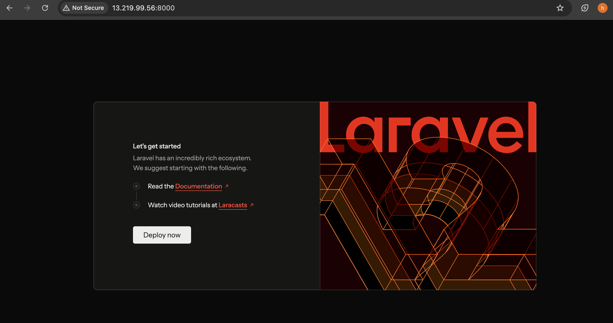

# Laravel Backend Deployment

This repository contains the setup and deployment scripts for the Laravel backend using GitHub Actions.

## Deployment Pipeline

The GitHub Actions pipeline (`deploy-backend.yml`) automates the deployment of the Laravel application to an Ubuntu server with Nginx and PHP 8.2-FPM.

### Key Steps:

1. **Checkout Code**
   - Pulls the `12.x` branch from the repository.

2. **Create `.env` File on Server**
   - Generates the Laravel environment file with sensitive credentials.
   - Secrets used:
     - `APP_KEY` (generated locally and stored in GitHub Secrets)
     - Database credentials (`DB_HOST`, `DB_USERNAME`, `DB_PASSWORD`, `DB_DATABASE`) from AWS RDS.
   - This step ensures the app has correct environment settings for database and app key.

3. **Deploy Laravel App**
   - Clones the repository if not present, or updates it to the latest commit.
   - Runs `deploy.sh` to:
     - Install PHP 8.2, Composer, and Nginx if not installed.
     - Configure Nginx for the Laravel app.
     - Set file permissions.
     - Install composer dependencies and optimize the autoloader.

4. **Run Migrations & Cache Setup**
   - Runs Laravel migrations with `php artisan migrate --force`.
   - Clears and caches configuration, routes, and application cache.
   - Restarts PHP-FPM and Nginx to apply changes.

### Notes

- The `.env` step is crucial to ensure the application has all required secrets and environment variables.
- Nginx is configured to serve the Laravel `public` directory on port 80.
- Database credentials are securely stored as GitHub Secrets, retrieved from AWS RDS.

### Screenshots

